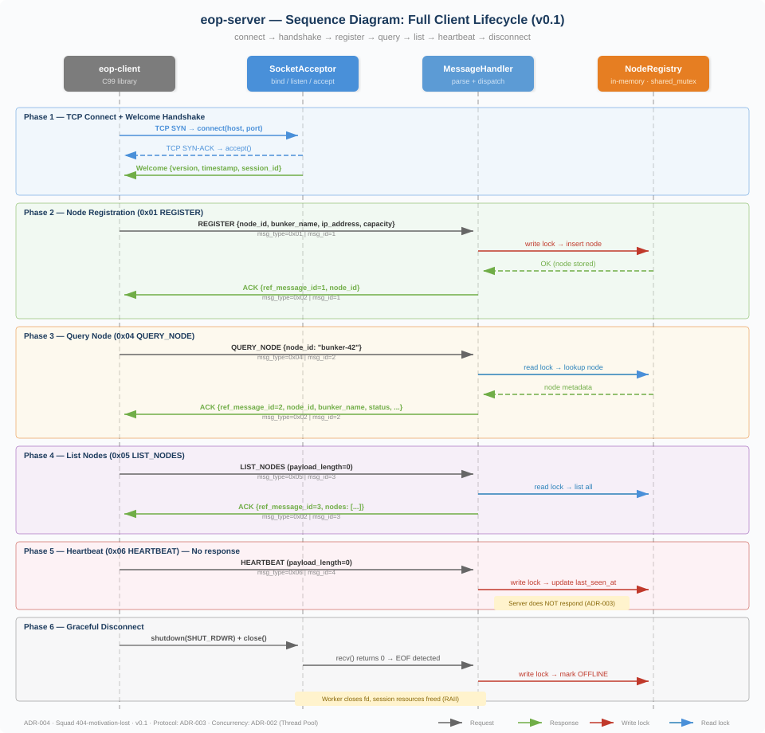
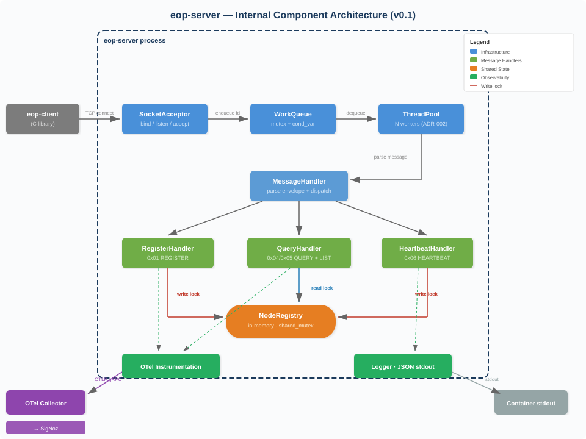

# ADR-004: Service Boundaries — Squad 404-motivation-lost

| Field | Value |
|-------|-------|
| **Date** | 21-03-2026 |
| **Status** | Accepted |
| **Lab** | v0.1 |
| **Deciders** | Squad 404-motivation-lost |

## Context

EOP is built incrementally across 4 releases. Without explicit service boundaries, responsibilities are undefined and integration points are ambiguous. Each release adds components:

- **v0.1:** C++ TCP server + C client library
- **v0.2:** HPC engine (separate process, connects as EOP node)
- **v0.3:** Go API gateway (separate process, connects via sockets)
- **v1.0:** MQTT broker + Go edge ingestor (separate processes)

The squad must define what each service does, what it does NOT do, and what guarantees it provides — for the current release and with awareness of future releases.

## Decision

### v0.1 Service: `eop-server`

A single service for v0.1 that encapsulates all server-side functionality.

| Field | Value |
|-------|-------|
| **Service name** | `eop-server` |
| **Language** | C++17 |
| **Responsibility** | Accept TCP connections, manage the node registry, handle message protocol, emit OTel traces, produce structured logs. |
| **Operations exposed** | `REGISTER`, `ACK`, `ERROR`, `QUERY_NODE`, `LIST_NODES`, `HEARTBEAT` |
| **Operations consumed** | None in v0.1 (server is the root of the call chain) |
| **State owned** | Node registry (in-memory): the authoritative source for node metadata and status |
| **Guarantees** | Responds within 200 ms P99 under nominal load. Node registry is consistent after ACK is sent. OFFLINE status is detected within 2× heartbeat interval. |

### Explicit Non-Responsibilities (v0.1)

- `eop-server` does NOT persist state to disk. The registry is in-memory and lost on restart. Persistence is not a v0.1 requirement (US-103 AC4)
- `eop-server` does NOT implement graph analysis. That is the HPC engine's responsibility (v0.2, ADR-008)
- `eop-server` does NOT expose HTTP/REST. That is the API gateway's responsibility (v0.3, ADR-010)
- `eop-server` does NOT handle MQTT. That is the edge ingestor's responsibility (v1.0, ADR-013)

### v0.1 Component: `eop-client` (C Library)

| Field | Value |
|-------|-------|
| **Component name** | `eop-client` |
| **Language** | C99 |
| **Type** | Library (not a standalone service) |
| **Responsibility** | Provide `eop_connect()`, `eop_send_command()`, `eop_disconnect()` as a public API. Abstract TCP socket management behind an opaque handle. |
| **Guarantees** | Thread-safe: multiple threads can call `eop_send_command()` on the same handle. Timeout on all operations (never blocks indefinitely). Clean resource release on disconnect. |

### Future Service Boundaries (documented for awareness, not implemented in v0.1)

| Service | Release | Relationship to eop-server |
|---------|---------|---------------------------|
| `hpc-engine` | v0.2 | Registers as an EOP node. Receives ANALYZE_GRAPH via eop-server dispatch (ADR-008) |
| `api-gateway` | v0.3 | Go process. Connects to eop-server as a TCP client. Translates HTTP/REST to socket protocol (ADR-010) |
| `mqtt-broker` | v1.0 | Mosquitto. Receives MQTT from ESP32 devices. No direct connection to eop-server (ADR-013) |
| `edge-ingestor` | v1.0 | Go process. Subscribes to MQTT broker, forwards to eop-server via socket protocol (ADR-013) |

### Client Lifecycle — Sequence Diagram

The diagram above shows the full client lifecycle: TCP connect, welcome handshake, node registration, query, list, heartbeat, and graceful disconnect. Each phase maps to a message type defined in ADR-003. Note that HEARTBEAT (0x06) is fire-and-forget — the server does not respond.

### Internal Architecture of `eop-server` (v0.1)

This is a modular monolith — all components are in-process but separated by clear interfaces. In v0.2, the `EngineDispatcher` module is added alongside the existing handlers without modifying them.

## Dependencies

| This service depends on | For what |
|------------------------|----------|
| OTel Collector | Exporting traces. If collector is down, spans are buffered locally (ADR-005) |
| SigNoz | Trace visualization. Not a runtime dependency — server operates normally without it |

| Depends on this service | For what |
|------------------------|----------|
| C client library (`eop-client`) | All client-side communication |
| HPC engine (v0.2) | Receives work dispatch, returns results |
| API gateway (v0.3) | Delegates REST requests to socket protocol |
| Edge ingestor (v1.0) | Forwards MQTT telemetry as socket messages |

## Consequences

- The single-service boundary for v0.1 avoids IPC overhead between components that share the same process
- The modular internal architecture enables adding the EngineDispatcher in v0.2 without refactoring the server core
- The service name `eop-server` is used consistently in all artifacts: K8s manifests, OTel `service.name` attribute, Grafana panels, and log `service` field
- The explicit non-responsibilities prevent scope creep: if someone asks "should the server persist to disk?", this ADR says no
